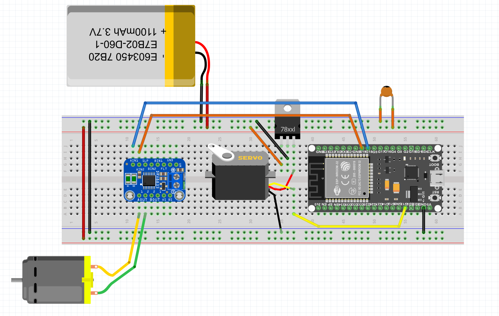

# BLEController project

## Parts

  - LiPo battery 7.4V
  - Motor driver (any with low voltage drop so avoid L293D) good examples are DRV8833 or TB6612 (https://botland.store/drivers-for-dc-motors/6934-dfrobot-hr8833-two-channel-driver-for-dc-10v15a-motors-5904422361402.html)
  - Servo (size and torque will depend on the application, for example https://botland.store/standard-servos/817-servo-towerpro-mg-995-standard-5904422329723.html)
  - DC Engine (for example N20 micro engine https://botland.store/n20-micro-motors-mp-series-medium-power/12593-micro-motor-n20-bt34-298-1-45rpm-9v-5904422319724.html)
  - Linear Voltage Regulator (https://botland.store/voltage-regulators/81-linear-voltage-regulator-5v-l7805abv-tht-to220-5904422307202.html)
  - Small filtering capacitor

## Schematic

Fritzing file with schematic is placed in the repository (Schematic.fzz)